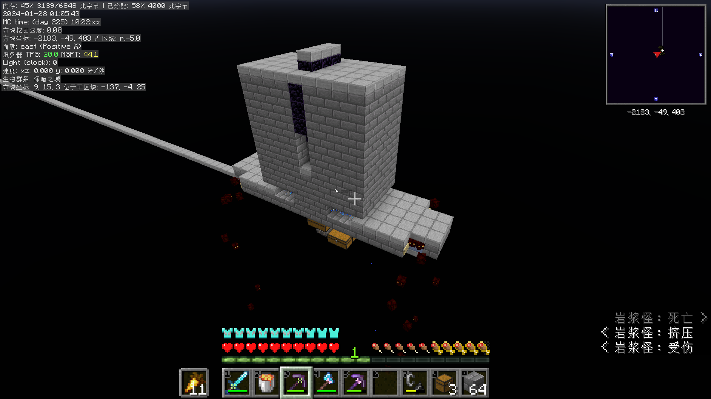
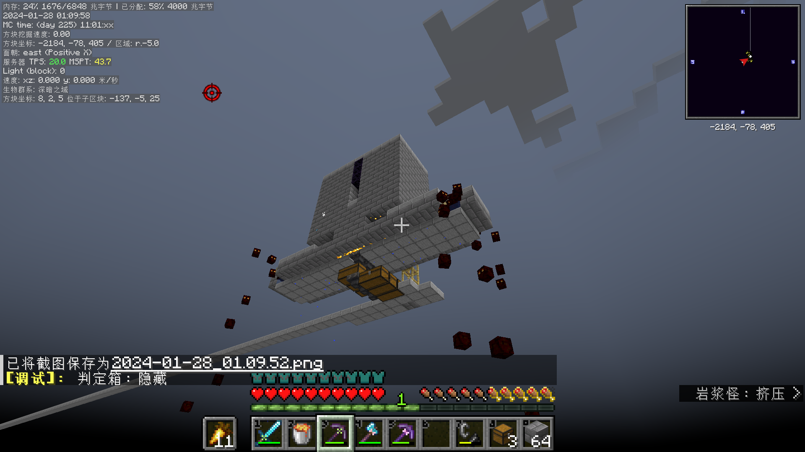
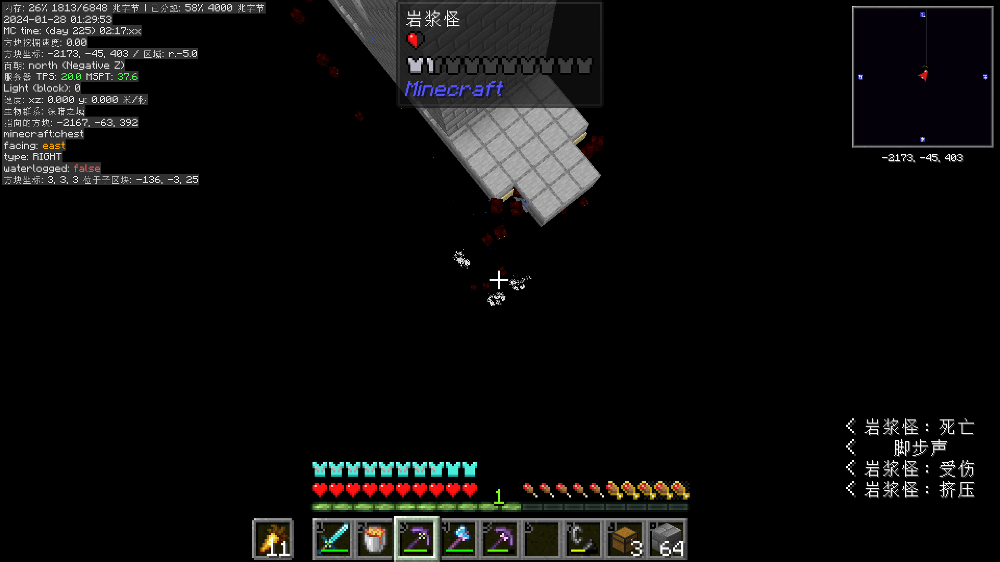

<head>
    
    
</head>

一种在空岛中使用的双维度岩浆怪农场，改编自[大叔](https://space.bilibili.com/19428259/dynamic?spm_id_from=333.1365.list.card_avatar.click)的[岩浆怪农场](https://www.bilibili.com/video/BV1Rk4y1774n/?spm_id_from=333.788.video.desc.click&vd_source=e83f6243963f730d4d2994d23f588a9d)，放弃了对小岩浆怪的处理。

在我[逐块空岛(Chunk By Chunk)](https://www.curseforge.com/minecraft/mc-mods/chunk-by-chunk)生存前期，没有凋零玫瑰，只有少量的细雪。完全无法处理小岩浆怪。所以索性使用双维度并放弃处理小岩浆怪。

唯一可能的想法是用24矿车挤死处理方法。但是嫌麻烦直接扔虚空算了。

于是就有了壮观的一幕。大量的小岩浆怪像shi一样挤出处死部分。

